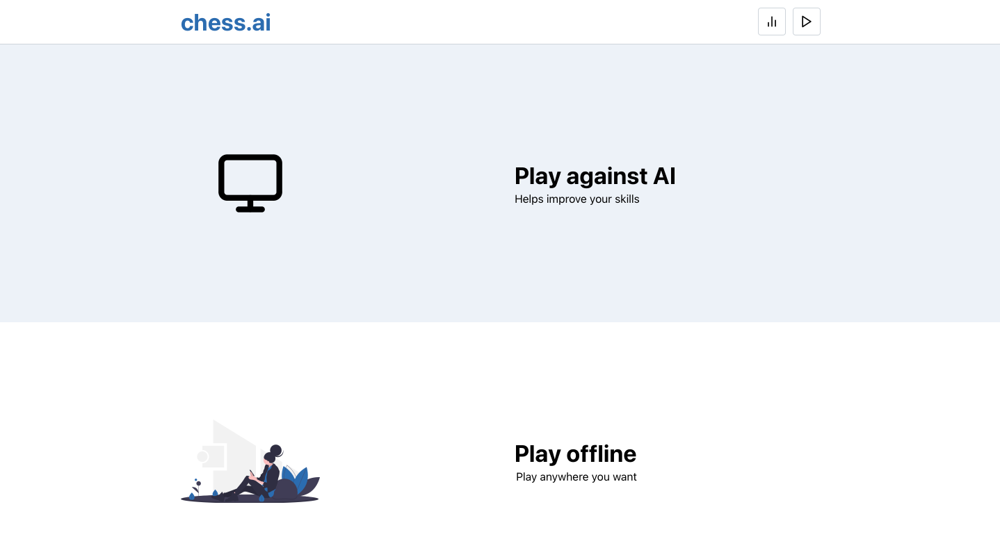
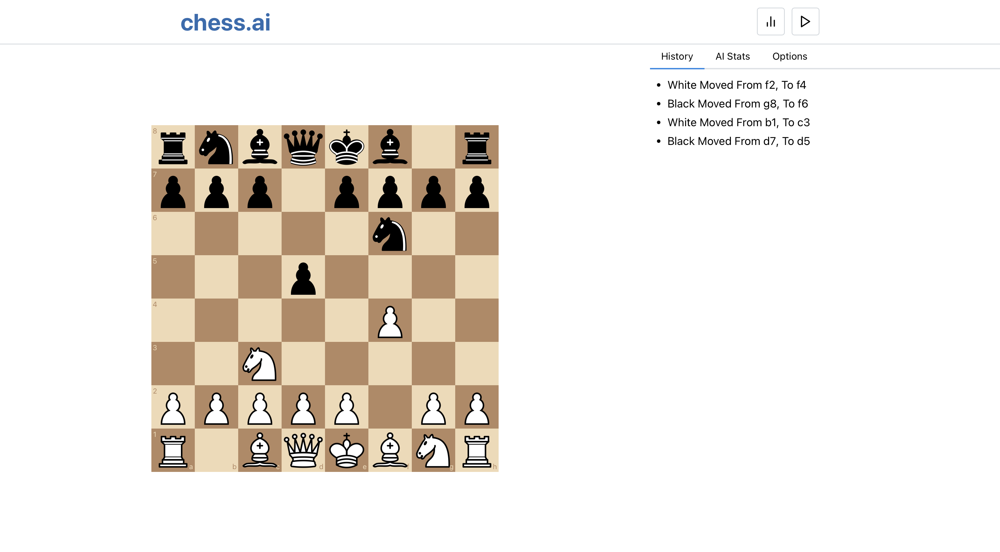

# Chess AI with React JS and Next JS

## Overview

This web application was built with React JS and Next JS, and designed to allow users to play chess against a computer opponent.




## Installation

To run this Chess AI application locally, clone the repo and then:

1. Navigate to the directory and install the dependencies:

   ```bash
   npm install
   ```

2. Start the development server:

   ```bash
   npm run dev
   ```

3. Open your web browser and access the application at [http://localhost:3000](http://localhost:3000).

## AI Algorithm

The application utilizes a basic minimax algorithm with alpha-beta pruning.

The AI opponent is not intended to be exceptionally strong, to further the difficulty, the depth of possible moves that the algorithm calculates up to can be adjusted.

## Technologies Used

- React JS
- Next JS
- Chess.js (for chess rules and move generation)
- Alpha-beta pruning algorithm